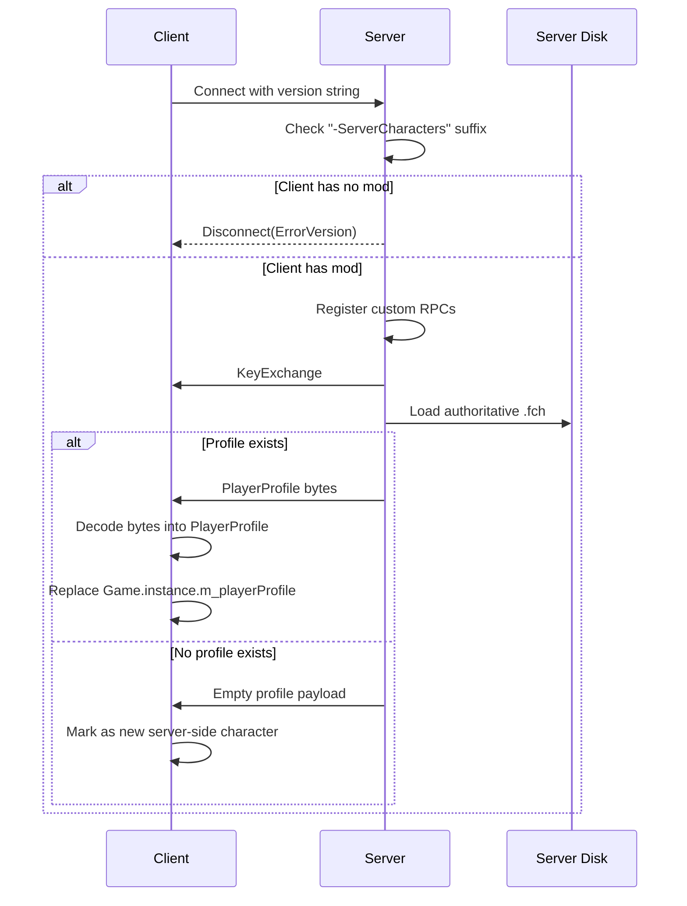
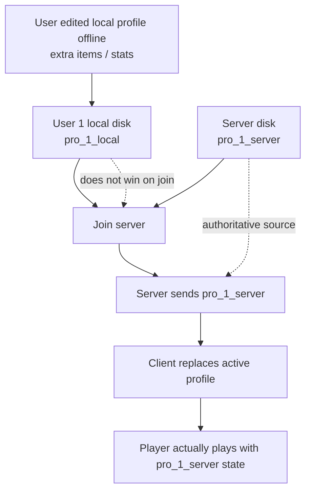
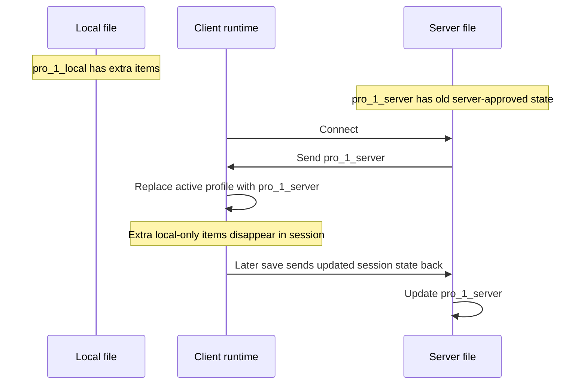
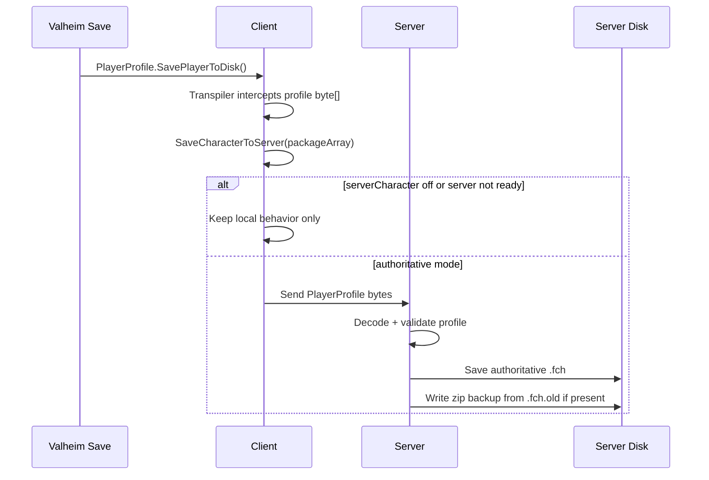
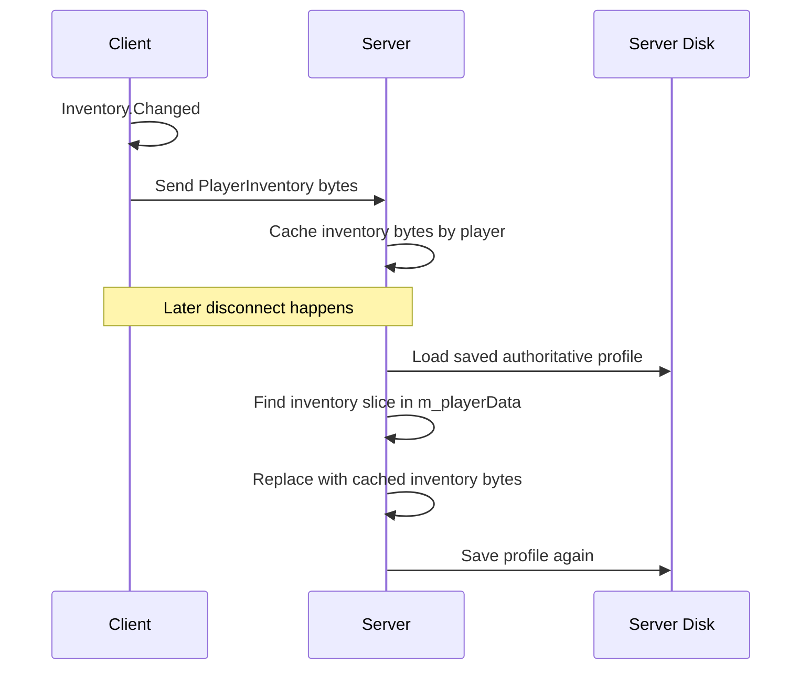
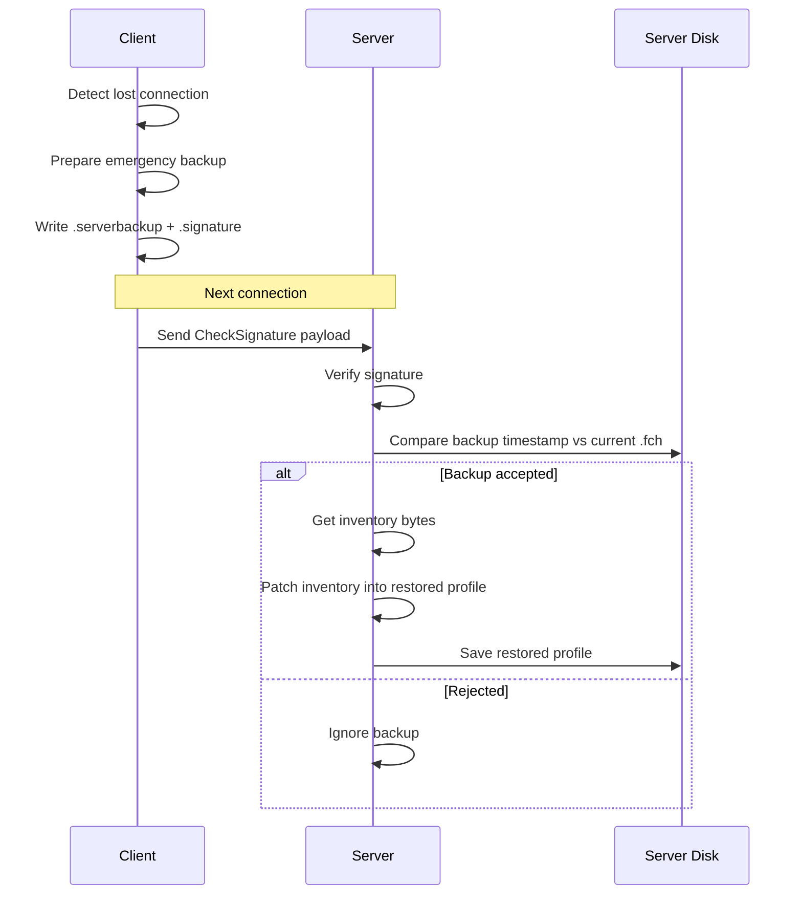
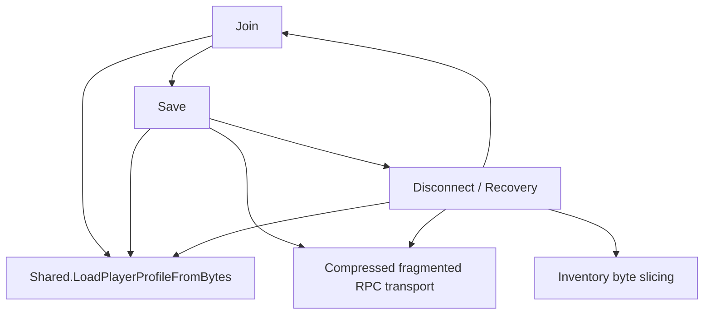

# Core Paths

Tài liệu này chỉ giữ 3 luồng quan trọng nhất của mod ở baseline hiện tại:

1. `join`
2. `save`
3. `disconnect / recovery`

Mục tiêu là nhìn được xương sống của mod mà không bị nhiễu bởi admin commands, web API, AFK, maintenance UI, hoặc template logic.

## Path 1: Join

### Mục tiêu

Khi client kết nối:

- server xác nhận client có mod
- server gửi profile authoritative nếu có
- client thay local profile bằng profile từ server
- nếu chưa có profile authoritative, client đi vào nhánh new-character/template

### Điểm vào chính

- [`Shared.PatchZNetRPC_PeerInfo.Prefix`](./ServerCharacters/Shared.cs:151)
- [`ServerSide.PatchZNetOnNewConnection.Postfix`](./ServerCharacters/ServerSide.cs:32)
- [`ServerSide.SendConfigsAfterLogin.Postfix`](./ServerCharacters/ServerSide.cs:379)
- [`ClientSide.PatchZNetOnNewConnection.Postfix`](./ServerCharacters/ClientSide.cs:433)
- [`ClientSide.onReceivedProfile`](./ServerCharacters/ClientSide.cs:533)

### Flow

### Những gì thật sự quyết định join thành công

- `Shared.cs` phải chấp nhận version string
- server phải đọc được `.fch` hiện có
- `Shared.LoadPlayerProfileFromBytes()` phải decode được payload
- client phải chấp nhận tên nhân vật sau khi decode

### Ví dụ trực quan: `pro_1_local` và `pro_1_server`

### Nhánh đặc biệt

- maintenance mode có thể chặn non-admin ngay ở `OnNewConnection`
- single-character mode có thể chặn việc tạo nhân vật thứ hai ở `SendConfigsAfterLogin`
- empty payload không hẳn là lỗi; đó có thể là case server chưa có character cho người chơi đó

## Path 2: Save

### Mục tiêu

Khi client save:

- profile bytes được trích ra từ save flow của game
- nếu đang ở chế độ authoritative, client gửi bytes đó lên server
- server decode và ghi thành authoritative `.fch`

### Điểm vào chính

- [`ClientSide.PatchPlayerProfileSave_Client`](./ServerCharacters/ClientSide.cs:290)
- [`ClientSide.SaveCharacterToServer`](./ServerCharacters/ClientSide.cs:293)
- [`Shared.sendCompressedDataToPeer`](./ServerCharacters/Shared.cs:18)
- [`ServerSide.onReceivedProfile`](./ServerCharacters/ServerSide.cs:80)
- [`PatchPlayerProfileSave_Server.Postfix`](./ServerCharacters/ServerSide.cs:563)

### Flow

### Điều kiện để path này ổn

- transpiler ở `PatchPlayerProfileSave_Client` phải còn match đúng IL của game
- `sendCompressedDataToPeer` phải gửi đủ fragments
- `receiveCompressedFromPeer` phải ráp đúng payload
- `ServerSide.onReceivedProfile` phải decode được profile bytes
- `profile.SavePlayerToDisk()` phía server phải ghi ra đúng dữ liệu authoritative

### Điểm quan trọng

- đây là path quan trọng nhất của mod
- nếu path này hỏng, server authority không còn ý nghĩa

## Path 3: Disconnect / Recovery

### Mục tiêu

Khi mất kết nối hoặc disconnect:

- client cố giữ lại một emergency backup
- server cố giữ inventory gần nhất
- khi reconnect, server có thể thử restore backup nếu backup mới hơn save hiện tại

### Điểm vào chính

- [`ClientSide.PatchGameLogout.Prefix`](./ServerCharacters/ClientSide.cs:998)
- [`ClientSide.PatchPlayerProfilePlayerSave.Prefix`](./ServerCharacters/ClientSide.cs:275)
- [`ClientSide.SaveCharacterToServer`](./ServerCharacters/ClientSide.cs:293)
- [`ClientSide.PatchInventoryChanged.Prefix`](./ServerCharacters/ClientSide.cs:1036)
- [`ServerSide.onReceivedInventory`](./ServerCharacters/ServerSide.cs:111)
- [`ServerSide.PatchZNetDisconnect.Prefix`](./ServerCharacters/ServerSide.cs:352)
- [`ServerSide.onReceivedSignature`](./ServerCharacters/ServerSide.cs:113)

### Flow A: inventory preservation on disconnect

### Flow B: emergency backup restore on reconnect

### Tại sao path này phức tạp nhất

- nó dính cả `snapshot`, `inventory RPC`, `disconnect timing`, `backup signature`, và `byte surgery`
- nó không chỉ “load/save profile” mà còn cố vá state để tránh mất đồ

### Chỗ phụ thuộc kỹ thuật cao

- `PlayerSnapshot`
- `generateProfileSignature`
- `receiveEncryptionKeyFromServer`
- `ReadInventoryFromProfile`
- `PatchPlayerProfileInventory`
- `ConsumePlayerSaveUntilInventory`

## Dependency View

## What To Protect First

Nếu sau này chỉnh mod này, có 3 thứ không nên phá:

1. `Join` phải luôn decode được authoritative profile
2. `Save` phải luôn gửi và ghi được `.fch` authoritative
3. `Disconnect / Recovery` nếu chưa chắc chắn thì nên đơn giản hóa, vì đây là path rủi ro nhất

## Practical Reading Order

Nếu cần tiếp tục đọc code theo đúng core path:

1. [Shared.cs](/home/tuanpm1/Dev/mods/ServerCharacters/ServerCharacters/Shared.cs:18)
2. [ServerSide.cs](/home/tuanpm1/Dev/mods/ServerCharacters/ServerCharacters/ServerSide.cs:22)
3. [ClientSide.cs](/home/tuanpm1/Dev/mods/ServerCharacters/ServerCharacters/ClientSide.cs:290)
4. [ClientSide.cs](/home/tuanpm1/Dev/mods/ServerCharacters/ServerCharacters/ClientSide.cs:429)
5. [ServerSide.cs](/home/tuanpm1/Dev/mods/ServerCharacters/ServerCharacters/ServerSide.cs:611)
