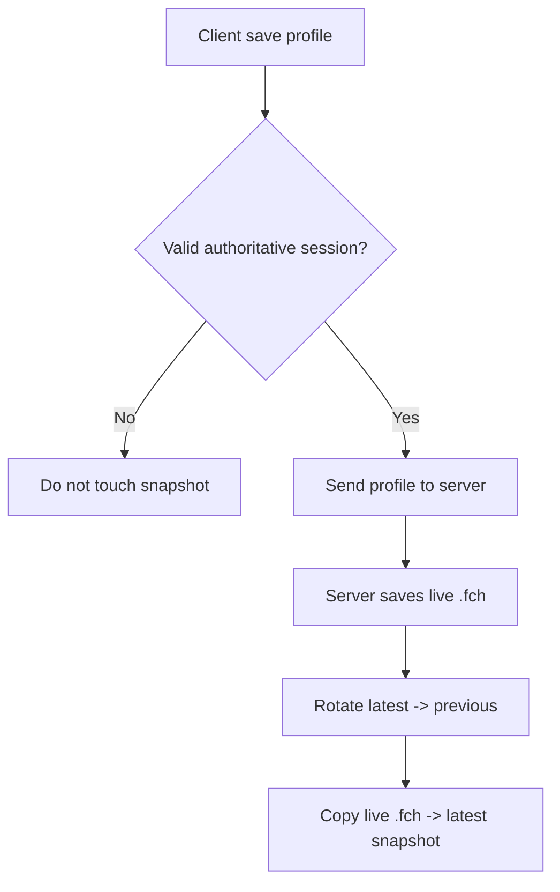
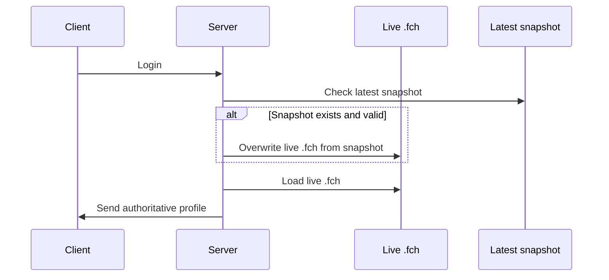

# Implementation Sketch

Tài liệu này chốt một thiết kế tối giản cho workaround đã chọn:

- `Option B: Snapshot Overwrite On Login`

Mục tiêu:

- không cho local profile mang đồ lạ vào server
- không để offline save làm bẩn snapshot
- giữ thiết kế đủ đơn giản cho server bạn bè

## Scope

Thiết kế này chỉ nói về:

- snapshot character profile
- update snapshot
- restore snapshot lúc login
- guard conditions

Không nói về:

- web API
- maintenance
- admin RPC
- inventory surgery cải tiến

## Storage Layout

### Live runtime file

Valheim/mod vẫn dùng file live hiện có:

```text
<CharacterSavePath>/<player_profile>.fch
```

### Snapshot file

Mỗi player có snapshot riêng trong thư mục riêng:

```text
<CharacterSavePath>/server_snapshots/<player_profile>.latest.fch
<CharacterSavePath>/server_snapshots/<player_profile>.previous.fch
```

Ví dụ:

```text
characters/
  Steam_7656119_alice.fch
  server_snapshots/
    Steam_7656119_alice.latest.fch
    Steam_7656119_alice.previous.fch
```

## Core Policy

### Policy 1: Live file vẫn là runtime file

- game và mod vẫn đọc/ghi file `.fch` live như hiện tại
- không thay Valheim sang đọc trực tiếp từ snapshot folder

### Policy 2: Snapshot là authoritative login source

- khi player login, nếu có snapshot hợp lệ thì snapshot ghi đè lên live file trước khi server gửi profile xuống client

### Policy 3: Snapshot chỉ được cập nhật trong valid server-authoritative session

- offline save không được phép cập nhật snapshot

## Save-Time Behavior

### Khi nào update snapshot

Chỉ update snapshot nếu:

- đang ở client side
- đang kết nối dedicated server mục tiêu
- `serverCharacter == true`
- `ZNet.instance != null`
- `ZNet.instance.IsServer() == false`
- `ZNet.instance.GetServerPeer()?.IsReady() == true`
- profile save hiện tại là save thuộc server session

### Flow



### Ghi chú

Để đơn giản và ít lệch timing hơn:

- snapshot nên được cập nhật phía server sau khi save live thành công
- không nên dựa vào file local của client để cập nhật snapshot authoritative

## Login-Time Behavior

### Khi nào restore snapshot

Khi player login:

- xác định filename authoritative như mod đang làm
- tìm `latest snapshot` tương ứng
- nếu snapshot tồn tại và hợp lệ, copy snapshot sang live `.fch`
- sau đó mới load live `.fch` và gửi cho client

### Flow



## Validity Rules

### Snapshot considered valid if

- file exists
- file size > 0
- file can be decoded by `LoadPlayerProfileFromBytes` or `LoadPlayerFromDisk`
- filename matches expected player authoritative filename

### Snapshot considered invalid if

- file missing
- zero bytes
- cannot be decoded
- mismatched to wrong player/profile

### If snapshot invalid

- ignore snapshot
- continue with live profile
- log warning

## Rotation Policy

Giữ chính xác 2 bản:

- `latest`
- `previous`

### Update rule

1. nếu `latest` đang tồn tại:
   - move `latest` -> `previous`
2. copy `live` -> `latest`

### Mục đích

- nếu snapshot mới nhất hỏng
- vẫn còn một bản gần trước đó để cứu thủ công

## Restore Guard

Không restore snapshot một cách mù quáng nếu:

- live file đang mới hơn và vừa được save trong cùng session hiện tại
- snapshot không decode được
- player/profile mapping không khớp

Trong bản tối giản đầu tiên, có thể bỏ rule “compare time” để tránh phức tạp quá mức, miễn là:

- snapshot luôn được cập nhật sau save thành công
- login luôn tin snapshot hơn local-modified live state

## Minimal Logging

Nên log ít nhưng rõ:

- snapshot updated for `<profile>`
- snapshot skipped because session is not authoritative
- snapshot restored on login for `<profile>`
- snapshot invalid, using live profile for `<profile>`

## Failure Behavior

### Nếu snapshot update fail

- không chặn save live
- chỉ log lỗi
- player vẫn tiếp tục được

### Nếu snapshot restore fail

- không crash login
- fallback sang live profile
- log lỗi

## Why This Design Is Simple

Thiết kế này cố tình đơn giản ở các điểm sau:

- không để client quyết định authoritative snapshot
- không đọc runtime trực tiếp từ snapshot folder
- không làm version graph
- chỉ giữ 2 snapshot slots
- không thêm cloud sync

## Tradeoff Accepted

Thiết kế này chấp nhận:

- có thể rollback về snapshot gần nhất nếu snapshot policy chưa chuẩn
- không chống được server owner tự sửa file
- vẫn phụ thuộc vào core profile save/load hiện tại của mod

Nhưng đổi lại, nó đạt được mục tiêu chính:

- local offline progress không dễ xâm nhập server
- host không cần hiểu kỹ hệ thống phức tạp

## Recommended First Implementation Order

1. thêm thư mục `server_snapshots`
2. thêm helper rotate/copy snapshot
3. gọi update snapshot sau server save thành công
4. gọi restore snapshot trong login path trước khi gửi authoritative profile
5. thêm guard conditions và logging

## Out Of Scope For First Pass

Không làm ở vòng đầu:

- nhiều snapshot theo timestamp
- cloud backup
- hash/signature riêng cho snapshot
- cross-server snapshot sharing
- sửa lại toàn bộ inventory surgery
