# Module Breakdown

## Visual Map

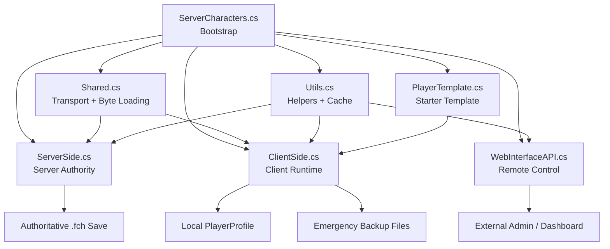

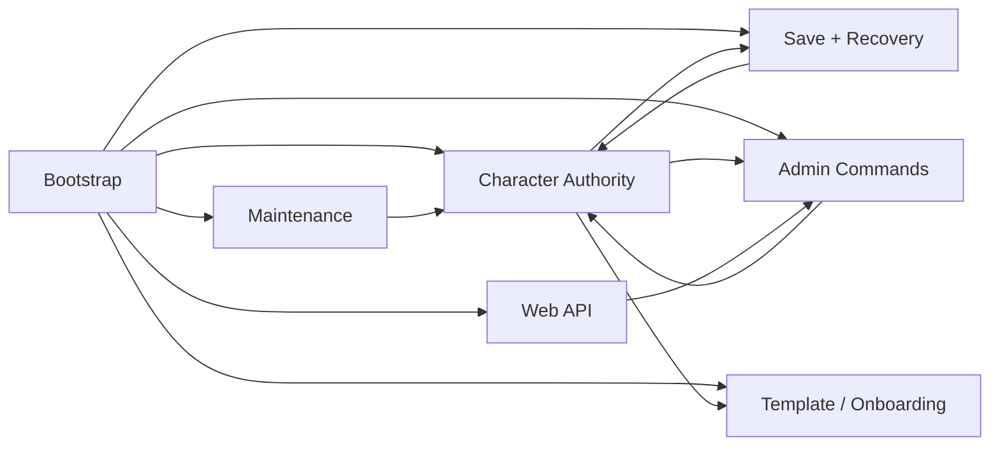

## 1. Plugin Bootstrap Module

Primary file:

- `ServerCharacters/ServerCharacters.cs`

Responsibility:

- initialize the plugin
- define all config entries
- patch the game with Harmony
- initialize storage and caches
- start background integrations

Main duties:

- binds config for:
  - general server behavior
  - save-file behavior
  - maintenance mode
  - first-login behavior
  - web API
  - poison persistence
- installs all Harmony patches from the assembly
- creates file watchers for:
  - `maintenance`
  - `CharacterTemplate.yml`
- creates/ensures the server encryption key
- migrates legacy character files into the active save folder
- normalizes older Steam-ID filenames
- preloads cached character profiles into memory

Game hooks used here:

- `BaseUnityPlugin.Awake()`
- patched `FejdStartup.Awake`
- `FixedUpdate()`

Why it matters:

- this file is the orchestration layer
- almost every feature of the mod is enabled from here

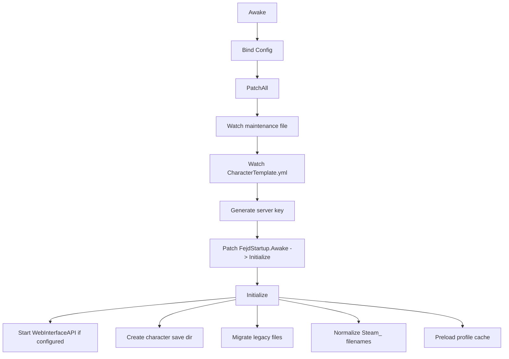

## 2. Character Authority Module

Primary files:

- `ServerCharacters/ServerSide.cs`
- `ServerCharacters/ClientSide.cs`
- `ServerCharacters/Shared.cs`

Responsibility:

- make the server the authoritative owner of player character data
- move profile bytes between client and server

Server-side behavior:

- when a player joins, load the server copy of that player's profile
- if `backupOnlyMode` is off, send that profile to the client
- receive later profile saves back from the client
- write the received profile to disk as the authoritative `.fch`

Client-side behavior:

- accept authoritative profile bytes from the server
- decode them into a `PlayerProfile`
- replace `Game.instance.m_playerProfile`
- when the game saves, forward the serialized profile back to the server

Core RPCs:

- `ServerCharacters PlayerProfile`
- `ServerCharacters KeyExchange`

Important implementation detail:

- profile loading from raw bytes is implemented through a Harmony transpiler, not a clean API

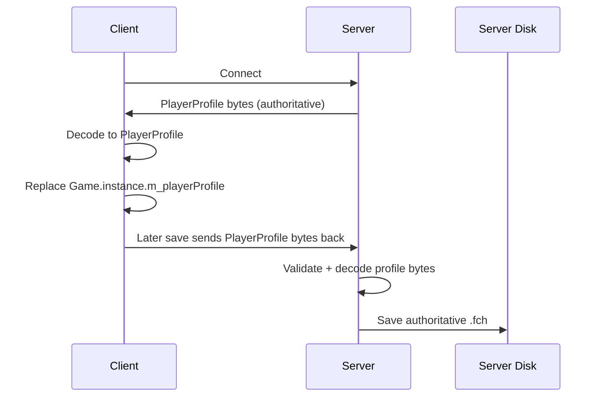

## 3. Transport / Serialization Module

Primary file:

- `ServerCharacters/Shared.cs`

Responsibility:

- send large profile payloads safely through Valheim RPC
- reconstruct them on the receiving side
- bridge raw `byte[]` into `PlayerProfile`

What it does:

- compresses payloads with `DeflateStream`
- fragments payloads into 250000-byte chunks
- reassembles fragments on receive
- caches in-progress fragments for up to 60 seconds
- rejects unmodded clients by checking the version suffix
- appends `-ServerCharacters` to the reported game version

Most important abstraction:

- `LoadPlayerProfileFromBytes(this PlayerProfile profile, byte[] data)`

This is one of the core foundations of the whole mod. If it breaks, most of the character system breaks.

```mermaid
flowchart LR
    A[byte[] profile payload] --> B[Deflate compress]
    B --> C[Split into fragments]
    C --> D[RPC send]
    D --> E[Receive fragments]
    E --> F[Reassemble by package id]
    F --> G[Deflate decompress]
    G --> H[onReceived byte[] callback]
```

## 4. Save and Backup Module

Primary files:

- `ServerCharacters/ClientSide.cs`
- `ServerCharacters/ServerSide.cs`

Responsibility:

- protect character data during save, disconnect, crash, and reconnect scenarios

Client-side responsibilities:

- when conditions indicate an unsafe disconnect, mark that an emergency backup should be made
- write:
  - `.fch.serverbackup`
  - `.fch.signature`
- hold enough local context to attempt later recovery

Server-side responsibilities:

- verify backup signatures sent by the client
- decide whether a backup is newer than the current authoritative save
- restore the backup if accepted
- create rolling zip backups from `.fch.old`

Core RPC:

- `ServerCharacters CheckSignature`

Why this exists:

- the mod assumes network loss or save timing can leave the server/client slightly out of sync
- this module tries to recover from that

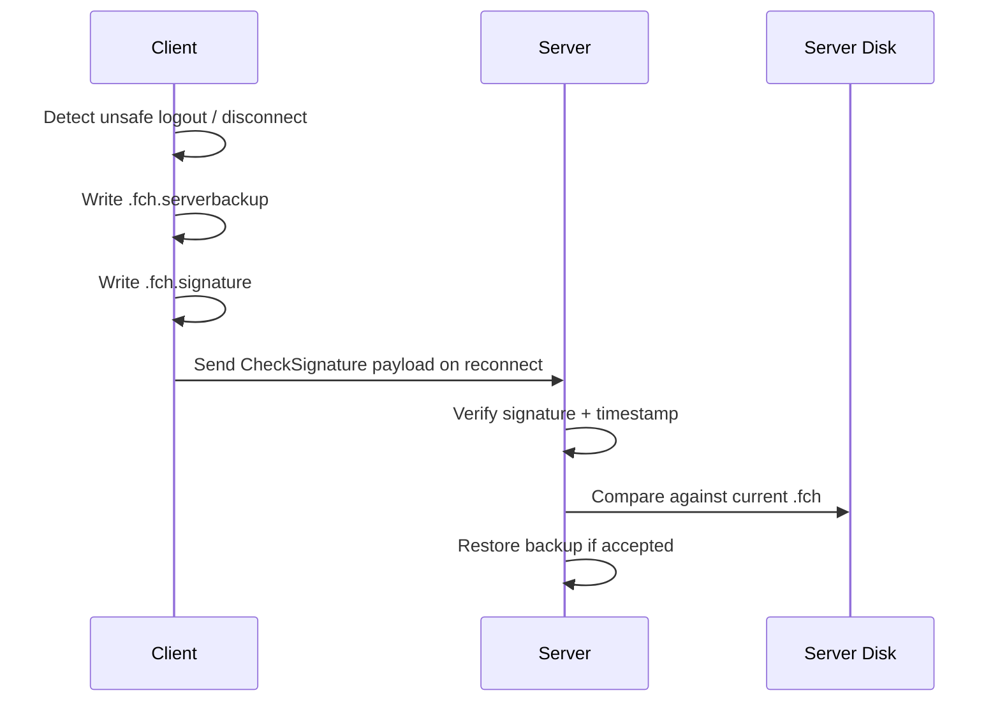

## 5. Inventory Sync and Inventory Surgery Module

Primary file:

- `ServerCharacters/ServerSide.cs`

Related file:

- `ServerCharacters/ClientSide.cs`

Responsibility:

- keep the player's inventory preserved even when the raw profile save and live inventory state diverge

Client-side behavior:

- on `Inventory.Changed`, serialize current inventory into a `ZPackage`
- send it to the server via `ServerCharacters PlayerInventory`

Server-side behavior:

- cache inventory bytes by player identity
- on disconnect or emergency restore, splice those inventory bytes into the saved profile payload

Important helper functions:

- `ReadInventoryFromProfile`
- `PatchPlayerProfileInventory`
- `ConsumePlayerSaveUntilInventory`

Technical note:

- this is not normal high-level object editing
- it is byte-slice replacement inside `profile.m_playerData`

This is one of the most specialized parts of the mod.

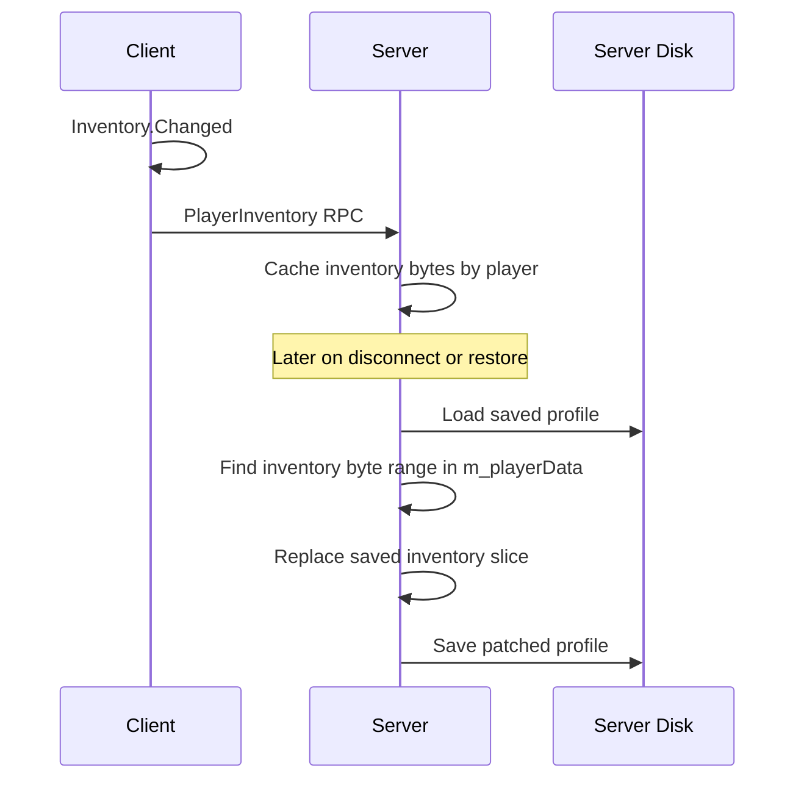

## 6. Skills Surgery Module

Primary file:

- `ServerCharacters/ServerSide.cs`

Responsibility:

- modify skill data inside offline or server-stored character files

What it does:

- reads serialized skills from `profile.m_playerData`
- modifies them with Valheim `Skills` logic
- writes the new skill bytes back into the profile payload

Important helper functions:

- `ReadSkillsFromProfile`
- `PatchPlayerProfileSkills`
- `ConsumePlayerSaveUntilSkills`

Usage:

- this module supports admin features like `raiseskill` and `resetskill` for both online and offline players

```mermaid
flowchart TD
    A[Load server .fch] --> B[Decode profile.m_playerData]
    B --> C[Consume until Skills section]
    C --> D[Load Skills object]
    D --> E[CheatRaiseSkill / CheatResetSkill]
    E --> F[Save Skills back to byte[]]
    F --> G[Replace Skills slice in m_playerData]
    G --> H[Save profile to disk]
```

## 7. Admin Command Module

Primary files:

- `ServerCharacters/ClientSide.cs`
- `ServerCharacters/ServerSide.cs`

Responsibility:

- provide server-admin powers through custom console commands and RPCs

Client console surface:

- `ServerCharacters resetskill`
- `ServerCharacters raiseskill`
- `ServerCharacters giveitem`
- `ServerCharacters teleport`
- `ServerCharacters summon`

Server responsibilities:

- validate whether caller is admin
- apply action to online players through RPC
- apply action to offline profiles by editing saved `.fch` data

Related RPCs:

- `ServerCharacters ResetSkill`
- `ServerCharacters RaiseSkill`
- `ServerCharacters GiveItem`
- `ServerCharacters GetPlayerPos`
- `ServerCharacters SendOwnPos`
- `ServerCharacters TeleportTo`

This subsystem is distinct from character authority. It is remote administration.

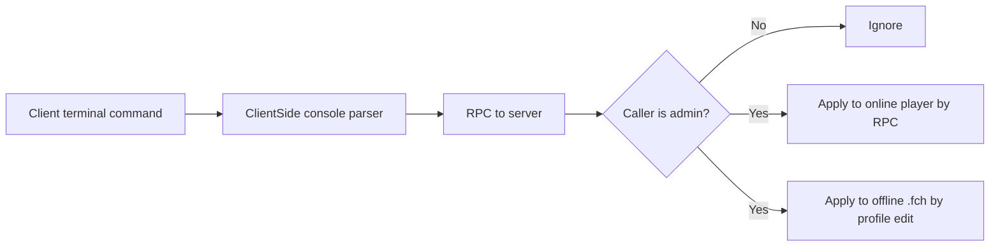

## 8. Maintenance Module

Primary file:

- `ServerCharacters/ServerCharacters.cs`

Related file:

- `ServerCharacters/ClientSide.cs`

Responsibility:

- let admins put the server into timed maintenance mode

What it does:

- starts a countdown when maintenance mode is enabled
- notifies players and Discord/web API listeners
- when the timer ends:
  - kicks non-admins
  - saves world and player profiles
  - blocks future non-admin joins

Client-side additions:

- shows a maintenance countdown on the minimap UI
- maps custom disconnect statuses to readable error messages

Special disconnect statuses:

- `MaintenanceDisconnectMagic`
- `CharacterNameDisconnectMagic`
- `SingleCharacterModeDisconnectMagic`

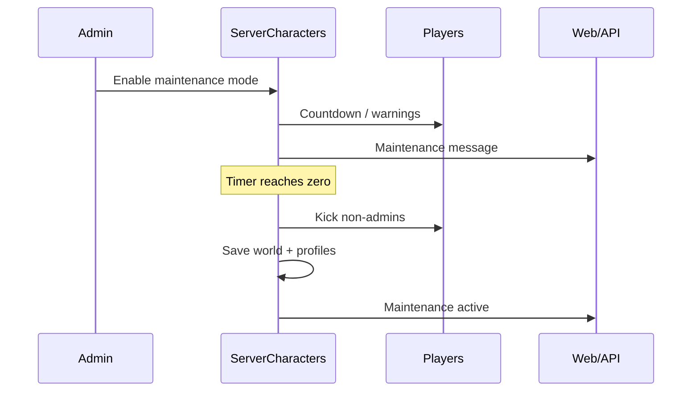

## 9. New Character Template Module

Primary files:

- `ServerCharacters/ServerCharacters.cs`
- `ServerCharacters/ClientSide.cs`
- `ServerCharacters/PlayerTemplate.cs`

Responsibility:

- define starter state for a newly created server-side character

Source file:

- `CharacterTemplate.yml`

Template can define:

- starter skills
- starter items
- one or more spawn positions

What happens:

- if the server has no authoritative profile for the connecting character, the client can be treated as a new server-side character
- on spawn, the mod clears current player state and applies the configured template
- intro/Valkyrie behavior can also be modified

This subsystem is onboarding logic for first-time characters.

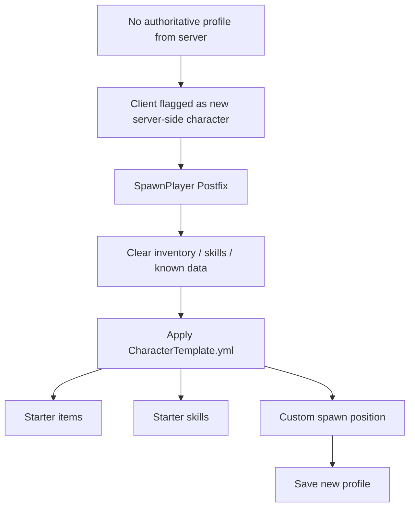

## 10. Poison Persistence Module

Primary file:

- `ServerCharacters/ClientSide.cs`

Responsibility:

- preserve poison status across logout/login so players cannot clear poison by disconnecting

How it works:

- on `Player.Save`, poison values are stored in `m_customData`
- on `Player.Load`, those values are read back and the poison effect is recreated

This is isolated compared with the larger character-sync systems.

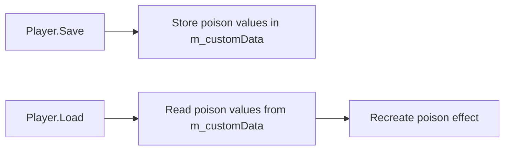

## 11. AFK Control Module

Primary files:

- `ServerCharacters/ServerCharacters.cs`
- `ServerCharacters/ClientSide.cs`

Responsibility:

- disconnect inactive non-admin players after a configured delay

How it works:

- input activity resets a counter
- a coroutine increments the counter each minute
- when threshold is reached, the client logs out and receives a message

This is a client-observed inactivity mechanism controlled by server config.

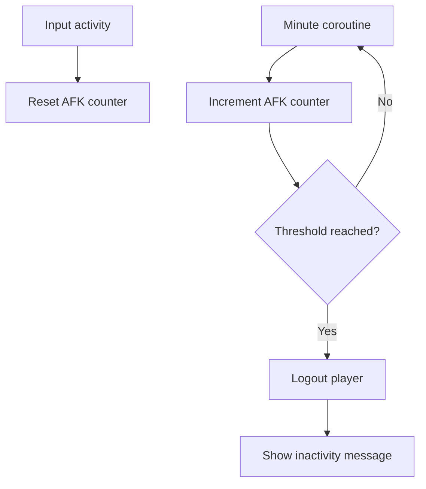

## 12. Hardcore Death Module

Primary file:

- `ServerCharacters/ClientSide.cs`

Responsibility:

- enforce server hardcore behavior on player death

Behavior:

- on death, mark `iDied`
- force logout shortly after
- save/death flow uses `ServerCharacters PlayerDied`
- server archives/deletes the saved profile path by moving the current file to `.old`
- connection UI explains the hardcore outcome

This subsystem piggybacks on the save/backup system rather than standing alone.

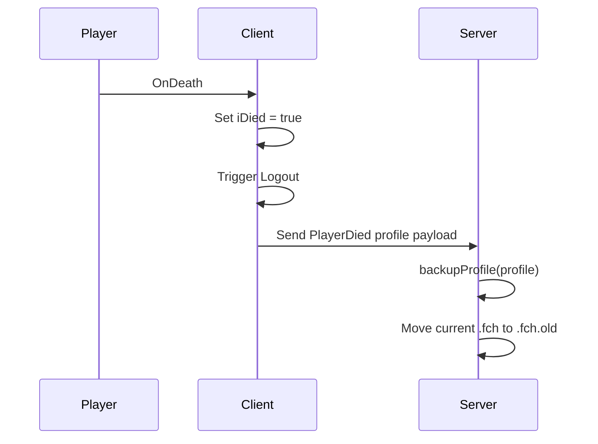

## 13. Web Interface Module

Primary file:

- `ServerCharacters/WebInterfaceAPI.cs`

Responsibility:

- expose the server state and selected commands over a TCP protocol

What it can provide:

- server config
- maintenance status
- player list
- mod list

What it can trigger:

- in-game messages
- player kicks
- save world
- give item
- raise skill
- reset skill

Message schema source:

- `ServerCharacters/Request.proto`

This subsystem is effectively an external control plane for the mod.

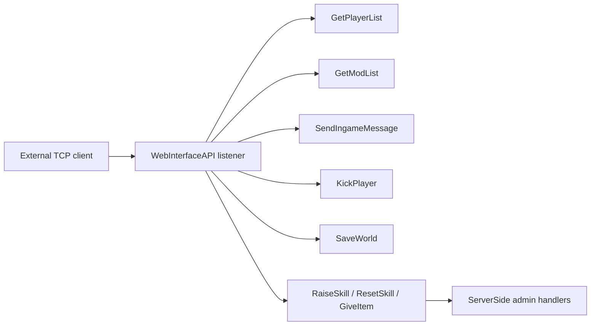

## 14. Utility and Cache Module

Primary file:

- `ServerCharacters/Utils.cs`

Responsibility:

- shared support code used by all other modules

Includes:

- config toggle helpers
- friendly time formatting
- Discord webhook posting
- log wrapper
- path helper for character saves
- file name pattern checks
- profile cache
- Steam ID normalization
- dictionary overwrite helper

This module is simple, but a lot of the rest of the code assumes its naming and path rules.

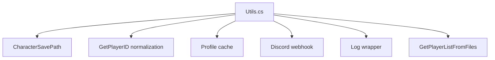

## Clean Mental Model

The baseline mod can be grouped into five major buckets:

1. character authority
2. save recovery
3. admin operations
4. server operations and maintenance
5. remote/external integrations

If we later simplify or rebuild behavior, this file is the best place to decide which bucket a feature belongs to.

## Core Path Diagram

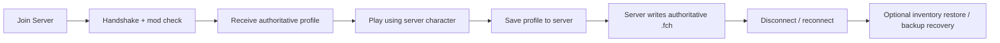
