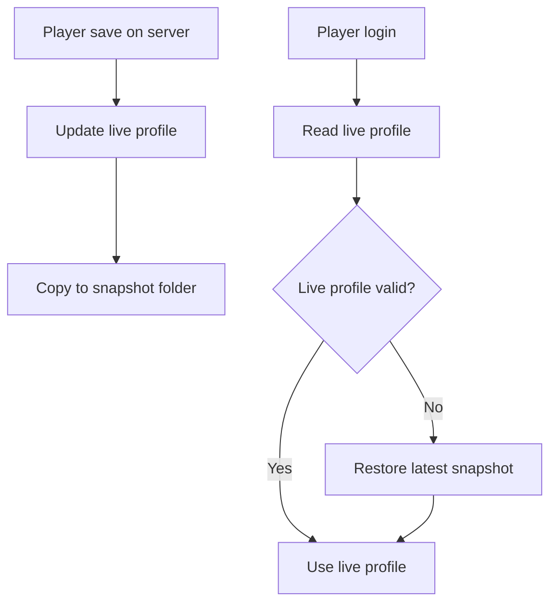
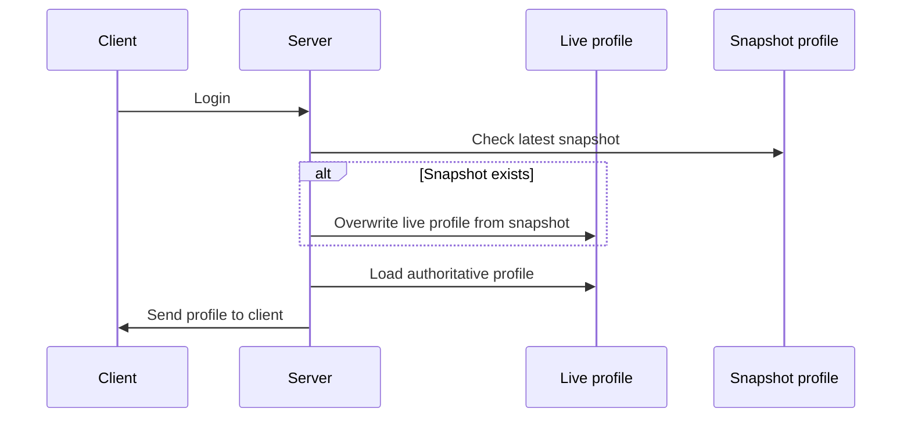
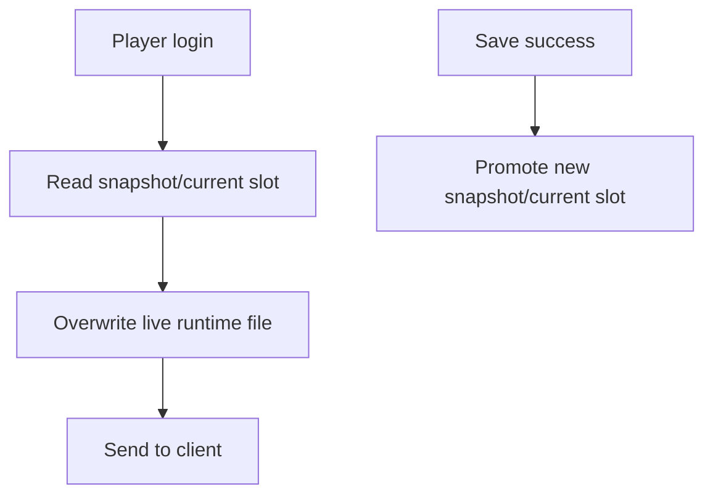
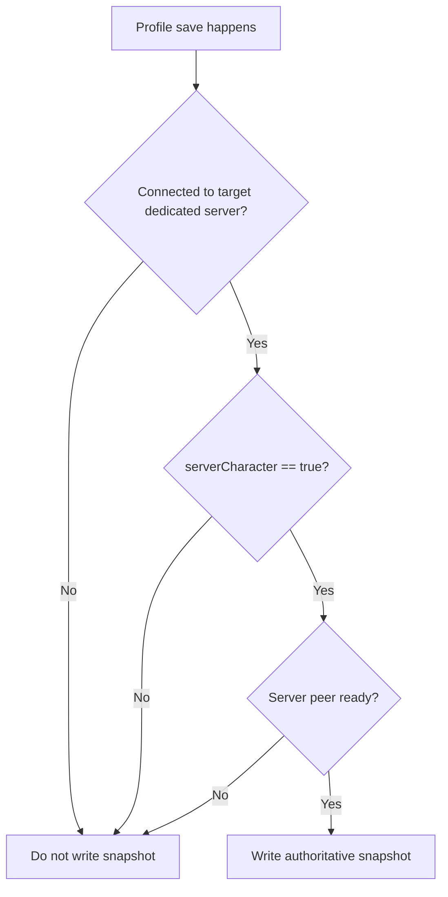
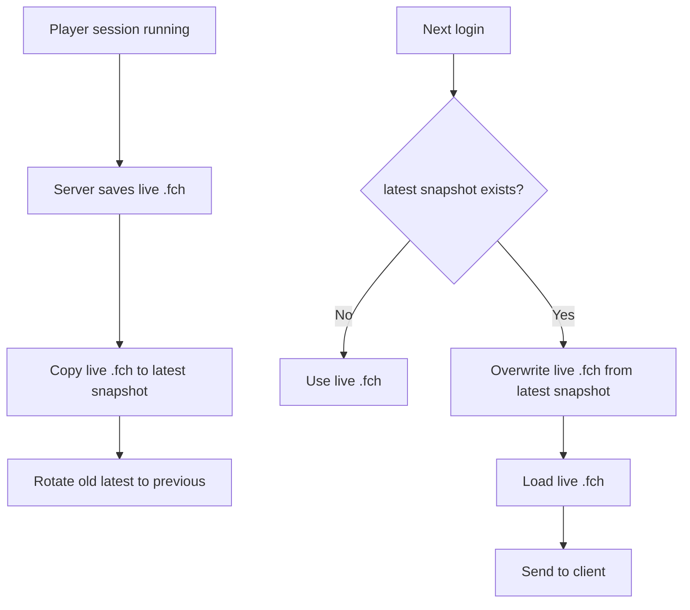

# Workaround Options

Tài liệu này không bàn về “thiết kế đẹp nhất”, mà bàn về cách workaround thực tế cho server bạn bè, ít kỹ thuật, và ưu tiên:

- không cho local profile mang đồ lạ vào server
- có đường lui khi save/profile lỗi
- vận hành đơn giản

## Mục tiêu thực tế

Bạn đang cần một cách để:

1. người chơi không mang item/stat từ local offline vào server
2. không phụ thuộc vào việc host phải hiểu sâu kỹ thuật
3. nếu có lỗi profile thì vẫn còn cách cứu

## Option A: Live SSOT + Snapshot Backup

### Ý tưởng

- `live profile` trên server là file authoritative chính
- sau mỗi lần save, tạo thêm một `snapshot`
- snapshot chỉ dùng để restore khi live lỗi

### Flow



### Ưu điểm

- đơn giản
- ít đụng vào flow login
- snapshot chỉ là backup, dễ hiểu
- rollback khi file live lỗi

### Nhược điểm

- không chặn hoàn toàn việc local profile cố mang item lạ vào nếu live authority đang có lỗ hổng
- chủ yếu là giải pháp recovery, không phải anti-cheat mạnh

### Đánh giá

- an toàn hơn
- dễ bảo trì hơn
- nhưng không giải quyết triệt để bài toán “mang đồ từ local vào”

## Option B: Snapshot Overwrite On Login

### Ý tưởng

- server vẫn lưu `live profile`
- sau mỗi lần save thành công, server cập nhật `snapshot`
- khi player login lần sau, nếu có snapshot thì snapshot ghi đè lại `live profile` trước khi server gửi profile cho client

### Flow



### Ý nghĩa thực tế

Nếu local player tự sửa profile hoặc mang item lạ từ offline vào:

- khi login, server đã reset lại `live profile` từ snapshot
- sau đó server gửi state đó xuống client
- local profile không thắng được snapshot/server state

### Ưu điểm

- chặn được kiểu “mang đồ local vào”
- logic dễ giải thích cho host:
  - “mỗi lần vào server, nhân vật sẽ bị ép về bản đã lưu ở server”

### Nhược điểm

- nếu snapshot cũ hơn progress mới nhất, người chơi bị rollback
- nếu snapshot update không đúng lúc, có thể mất progress hợp lệ
- thực chất snapshot đang đóng vai authoritative source lúc login
- không còn là backup thuần túy nữa

### Khi nào dùng được

- server nhỏ
- nhóm bạn quen nhau
- chấp nhận tradeoff “ưu tiên chống mang đồ local hơn là giữ mọi progress mới nhất tuyệt đối”

## Option C: Snapshot As Full SSOT

### Ý tưởng

- bỏ niềm tin vào `live profile`
- luôn coi snapshot/current-slot là file authoritative thật

### Flow



### Vấn đề

Đây không còn là workaround đơn giản nữa.

Bạn sẽ phải giải quyết:

- current vs previous slot
- temp file vs committed file
- save chưa hoàn tất thì slot nào hợp lệ
- rollback policy
- restore policy

### Đánh giá

- không phù hợp với nhu cầu hiện tại
- phức tạp quá mức cho một server bạn bè

## Khuyến nghị thực tế

Nếu mục tiêu chính là:

- không cho mang đồ local vào server
- host không rành công nghệ
- chấp nhận một chút rollback nếu cần

thì phương án phù hợp nhất là:

## Recommended: Option B

### Cách vận hành đề xuất

1. server save profile như bình thường
2. ngay sau save thành công, copy ra `snapshot` riêng
3. mỗi player chỉ giữ:
   - `latest snapshot`
   - và có thể thêm `previous snapshot`
4. khi player login:
   - nếu có `latest snapshot`, dùng nó ghi đè `live profile`
   - rồi mới load profile và gửi cho client

### Snapshot Guard Rules

Phần này rất quan trọng.

Nếu không có guard rules, người chơi có thể:

- vào offline
- chơi world riêng
- save local profile
- rồi mod lại snapshot nhầm progress offline

Khi đó snapshot authoritative bị “nhiễm” state local, và toàn bộ ý tưởng chống mang đồ local vào server sẽ hỏng.

Vì vậy snapshot chỉ được phép cập nhật khi session hiện tại là session authoritative hợp lệ.

### Chỉ cho phép ghi snapshot khi

- client đang kết nối tới dedicated server mục tiêu
- `serverCharacter == true`
- `ZNet.instance != null`
- `ZNet.instance.IsServer() == false`
- `ZNet.instance.GetServerPeer()?.IsReady() == true`
- profile hiện tại đã được server authoritative gửi xuống hoặc xác nhận

### Không được ghi snapshot khi

- đang ở offline / singleplayer
- đang ở local world riêng
- đang ở menu
- chưa hoàn tất handshake với server
- đang save một local profile không thuộc server-authoritative session

### Mermaid guard flow



### Ý nghĩa thực tế

Rule này đảm bảo:

- save offline chỉ làm thay đổi local file
- snapshot authoritative không bị cập nhật bởi offline progress
- lần login sau, server vẫn ép player về state đã được chấp nhận trong server session trước đó

### Nguyên tắc quan trọng

`local save` và `authoritative snapshot save` là hai việc khác nhau.

- local save: game tự làm
- authoritative snapshot save: mod chỉ làm trong đúng server session hợp lệ

### Cấu trúc thư mục gợi ý

```text
characters_live/
  Steam_xxx_alice.fch

characters_snapshot/
  Steam_xxx_alice.latest.fch
  Steam_xxx_alice.previous.fch
```

### Mermaid cho phương án khuyên dùng



## Tradeoff Summary

### Option A

- an toàn hơn cho progress
- yếu hơn trong việc chặn local cheat

### Option B

- mạnh hơn để chặn local cheat
- dễ rollback progress nếu snapshot policy không chuẩn

### Option C

- linh hoạt nhất trên lý thuyết
- phức tạp quá mức, không nên chọn lúc này

## Kết luận

Nếu chỉ cần một workaround chạy được cho server bạn bè:

- chọn `Option B: Snapshot Overwrite On Login`

Nếu muốn ưu tiên bảo toàn progress hơn anti-cheat:

- chọn `Option A: Live SSOT + Snapshot Backup`

Với hoàn cảnh bạn mô tả, `Option B` là phương án hợp lý nhất để thử trước.
